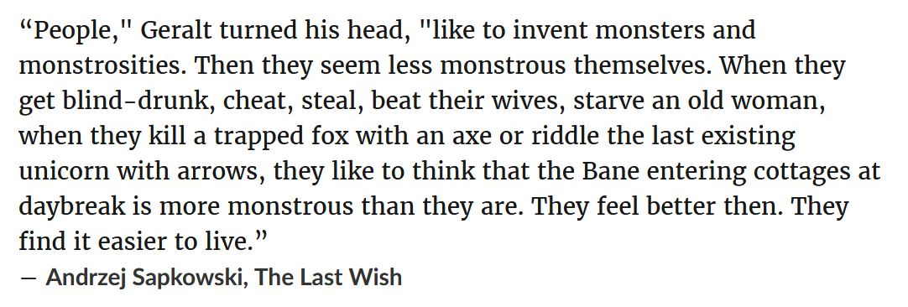

<!-- TABLE OF CONTENTS -->
## Table of contents
	
* [Story](#story)
* [Introduction](#introduction)
* [Explanation](#explanation)
  * [Explanation of the command](#explanation-of-the-command)
  * [The limitations](#the-limitations)
  * [How it all works](#how-it-all-works)
* [Implementation](#implementation)
* [Conclusion](#conclusion)
* [Future Work](#future-work)
* [References](#references)

<!-- STORY -->
## Story

Tell a story
  Jeremiah Dedon and the secret blinking morse code.

<!-- INTRODUCTION -->
## Introuction

Today you don't have to worry too much about the methods of concealing a message... Goner are the days when you had to ponder over the great selection of invisible inks to hide your secret affairs. You no longer have to worry about the safety of your servant when shaving its head with razor blades in order to write a message on his scalp, so that no one will bother to check once the hair grows back.

"So how would I do it today? I don't want to be held back from this awesome activity because of some outdated tools. I want to get my thoughts across without anyone getting the better of me" — you may impatiently say. As for most questions in life, computers are the  answer. More specifically, encoding a digital message into another digital file using a bit of ingenuity, tricks and algorithms. Getting the message out will be as simple as reversing the hiding action, removing the hassle and inconvenience in the process. Thus, we gather a lot of advantages from digital encoding:
* Very hard to decode if one doesn't know the method of hiding.
* Reliable, as the encoded file is persistent and doesn't change with time.
* No limitations. It's entirely possible that the message may very well be an image, a document, or anything other than plain text. Picture this... hiding an image inside another image :)
* It profoundly reduces noticeable alterations to the original image, in contrast to physical steganography where the paper encoded presents visible damage or irregularities.
* It's easy!

Clearly, there's an overwhelming superiority of digital steganography over traditional means. With so many advantages backing it up, it's only logical that people will want to use it. There's already a handful of tools out there capable of superbly hiding anything into images, implementing all the advantages mentioned above (Some tools are: "steghide", "jsteg" or "Hide'N'Steg"). This means that anyone with a home computer can get on board with hiding texts, and those programs will greatly imporve the experience of doing so. 

Alright, now you're interested in the subtle arts of hiding things in plain sight and want to learn more about it... How do you use it? What are the possibilities and what are the downsides? And how is such a seemingly complex process achieved? I will begin addressing all of those questions and give a top-down explanation of how this system works, as well as how it can be implemented using computer code.

<!-- EXPLANATION -->
## Explanation

Without wasting anymore time, let's jump straight into what makes computer steganography such an amazing field to work in. Grab your linux distro and terminal of your choice, install "steghide", (a tool of my choice) and let's hide some messages! Here I have a text file containing one of the most popular quotes of Geralt from "The Witcher" books, and right beside it, a picture of a cat.

 

  

    
  

  

    
  

 

Fire up the terminal, and let's embed the text file right inside that cat.jpeg.

	[Picture of the terminal with the command and arguments to embed a message into a picture]

	steghide embed -v -cf "cat.jpg" -ef "witcher_quote.txt"

<!-- EXPLANATION OF THE COMMAND -->
### Explanation of the command
* steghide is the name of the compiled binary we're going to use.
* embed is the first option that steghide needs to get as input when you want to hide files.
* the well known -v flag for verbose output gives extra information on what is hapenning behind the hood.
* the -cf is for "cover file" and the next argument will specify the path of the file you want to embed into. In this context, "cover file" is just a fancy term for my cat image.
* the -ef flag stands for "embed file" and lets you pass the path of the file you want to hide, and in this case it's going to be my witcher quote.

Executing this command will begin the process of embedding the data, and if everything runs smoothly, you should get an output like this:

	[Picture showing output]

Steghide will hide the data directly inside of that image, so be sure you'll have a backup just in case, because you're not getting your original file back.

Now take a look at the modified image! It's so cool, it's marvelous, it's... it's the same image. Remember when I told you the file remains more or less the same and there's no way of telling with the naked eye that there's something hidden inside? — That's exactly the point. The integrity of the original file must approximatively remain the same for the steganographic process to be successful. Now, there is not to say that there will be someone ceasing you from cramming in so much data that you completely eradicate even the slightest trace of a cat in that image; it will also be quite obvious that you've hidden something secret when your feline buddy looks like the noise of an old cathode tube TV. Additionally, you can hide your texts in audio files which is another format that doesn't require precision in order to be understood by us.

<!-- THE LIMITATIONS -->
### The limitations
As you've noticed, steganography very much likes to play with human perception and our inability of distinguishing slight changes on grand scales. I can only describe it as being a very precise tool that deals with imprecision. However, if you push it too hard, it might break on you, as it is with any fine and precise tool. For instance, passing a file too big for embedding will result in an error as there is so much space you can use in an image or audio file. Moreover, there's only a handful of file formats that can be used as cover files. Think about it; it wouldn't make sense to change the inner workings of a text message, it's going to result in something incoherent because the text file is too precise in what it has to offer. Let me explain in more detail:

<!-- HOW IT ALL WORKS -->
### How it all works
As we all know, our computer files are all made from a very long sequence of bytes, which represent contiguous blocks of memory on our storage devices. However, the way we interpret those bytes is very important... We can choose to look at a file as an image, text document, e-book or a game. I don't care that the sequence of bytes 01100011 01100001 01110100 spells out "cat" in ascii, all I can really see is this strange grey-purple. That's right! I chose to interpret the bytes as a pixel made out of R(ed)G(reen)(B)lue values (I came to understand that computer science is just a big and extensive collection of standards, and this example shows why they're so important). Realising this holds the key to our understanding of steganography.

So here's a plan of attack: Break down the file into its elementary components and fit them into your cover file, make sure it can't be noticed, keep the image file as it, and don't increase the size and don't just paste the characters at the end. It's afterwards mandatory that you can extract the file as it was before this process took place. Luckily, you don't have to find ways of resolving all of those problems and you can adapt what other very smart people developed. Least Significant Bit, LSB in short, refers to the first bit that has the lowest importance in large-scale operations. For example, the first bit of the number 100 is zero, whereas for 101 is one, so changing the last bit had only a significance in changing the number's parity. On the other hand, if I change the most significant bit of 100 (which also happens to be zero), all of the sudden from 100 we skyrocket all the way to 228. The same goes for colors as well: 252, 3, 144 in RGB is a beautiful and warm pink. If I change the last bit into one so that the green value turns from 3 to 131, the color will change significantly.

The big revelation is that changing the LSB from any of the pixel's color values will imperceptibly change the color and thus, doing so to every byte of information will result in a copy of the image with vast amounts differences. The new file is by all means identically to the original and completely changed at the same time.

How does this help us? Well, those changed bits could be tiny segments of our message we so dearly want to encode! Breaking up our message into small bits and sticking them at the end of each pixel until we run out of data to encode will do the trick. This method not only superbly hides all of our data without increasing the size of the cover file, but also keeps the integrity of the original intact. Afterwards, we can reconstruct our message by reversing the process and get the ending bite of every pixel,  sequentially sticking them one next to each other until we get the original message back in full glory.

<!-- IMPLEMENTATION -->
## Implementation

<!-- CONCLUSION -->
## Conclusion
  Write conclusion

<!-- FUTURE WORK -->
## Future work
  Write future work

<!-- References -->
## References
  Write references
